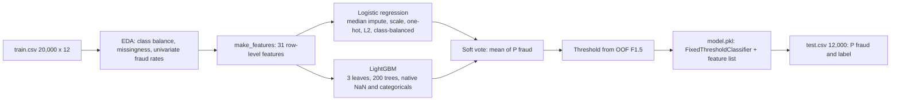

# DLW Datathon 2026, Track 2: Intelligent Financial Fraud Detection

> **Current portal submission:** [v4 notebook, model, prediction CSV, report, and validation](submission/portal_v4/). The remainder of this README describes the earlier ensemble.

Binary classification of card and transfer transactions as fraud or legitimate, under heavy class imbalance
(353 positives in 20,000, a 1.77% base rate). The deliverable is one notebook,
[`submission/fraud_detection_track2.ipynb`](submission/fraud_detection_track2.ipynb), a serialised model, and a
one-page report.

**Approach in one paragraph.** A soft-voting ensemble of (a) an L2-regularised logistic regression on standardised,
one-hot-encoded features and (b) a shallow gradient-boosted tree model (LightGBM, 3 leaves, 200 rounds), trained on 31
engineered features. Model selection uses stratified 5-fold cross-validation on average precision (PR-AUC). The decision
threshold is chosen on out-of-fold probabilities by maximising F-beta with beta = 1.5 and is serialised with the model.
Cross-validated PR-AUC is 0.206 (fold mean 0.214, s.d. 0.020) against a 0.018 no-skill baseline; ROC-AUC is 0.785.



## 1. Problem framing

| Aspect | Decision | Reason |
|---|---|---|
| Task | Binary classification, output P(fraud) | Ranking metric plus thresholded metrics are both scored |
| Primary metric | PR-AUC (average precision) | With 1.77% positives, ROC-AUC is dominated by true negatives; PR-AUC is sensitive to precision in the top of the ranking, which is what a fraud team acts on |
| Secondary metrics | F1 and recall at a chosen threshold | Scored by the organisers; a threshold of 0.5 is arbitrary under imbalance |
| Not used | Accuracy | "Always legitimate" scores 98.2% |
| Main risk | Variance | 353 positives, about 70 per validation fold. High-capacity models fit noise and fold-to-fold estimates move by 0.02 PR-AUC |

## 2. Data

`id`, `transaction_amount`, `transaction_hour`, `merchant_category` (11 levels), `country` (10), `transaction_channel` (4),
`transactions_last_24h`, `spend_last_24h`, `account_age`, `new_device`, `transactions_last_1h`, `fraud`.

- **Integrity:** no duplicate ids, no train/test id overlap, test category levels are a subset of train, value ranges are
  plausible (amount S$2.50 to S$9,000; hour 0 to 23).
- **Missingness:** 8 columns have 0.5 to 0.8% missing in train and 2.0 to 2.4% in test, a covariate shift between the two
  sets. Missingness is weakly informative (fraud rate 3.0% where `spend_last_24h` is missing, 0% where `new_device` is).
- **Leakage check:** the velocity columns (`*_last_24h`, `*_last_1h`) describe the window before the transaction, so they
  are legitimate predictors. There is no customer or card key, so rows are treated as independent and no group-wise
  split is possible or needed.

**Univariate fraud rates (train):**

| Variable | Rate |
|---|---|
| `new_device` = 1 vs 0 | 7.50% vs 1.21% |
| `merchant_category`: luxury, cash_transfer, electronics vs grocery | 5.29%, 4.74%, 3.94% vs 0.76% |
| `country`: ID, VN, PH, JP vs SG | 4.05%, 3.74%, 3.44%, 3.40% vs 1.31% |
| `transaction_channel`: bank_transfer, ecommerce vs card_present | 2.84%, 2.40% vs 1.02% |
| `transaction_hour` in 23:00 to 03:00 | about 2x the base rate |

Fraud rows also have a higher median amount (S$224 vs S$74), lower median account age (336 vs 796 days) and heavier upper
tails in the velocity counts (90th percentile of `transactions_last_24h`: 19 vs 7). Every effect is modest; no single
variable separates the classes.

## 3. Preprocessing and features

No rows are dropped and nothing is clipped. `make_features(df)` is a pure, row-wise function used identically at fit
and predict time (31 columns):

| Feature | Definition |
|---|---|
| Raw numerics (7) | passed through; `NaN` preserved |
| `<col>_missing` (10) | indicator of a missing value, for every raw numeric and categorical column |
| `amount_log`, `account_age_log` | `log1p(x)`: tames right skew for the linear member |
| `amount_vs_recent_avg` | `amount / (spend_last_24h / transactions_last_24h)`: deviation from the account's recent mean ticket |
| `amount_share_of_24h` | `amount / (spend_last_24h + amount)` |
| `burst_1h_share` | `transactions_last_1h / transactions_last_24h`: short-window velocity |
| `is_night` | hour in {23, 0, 1, 2, 3, 4} |
| `is_foreign` | country known and not SG |
| `is_new_account` | `account_age < 90` |
| `high_risk_category` | category in {luxury, cash_transfer, electronics, travel} |
| `new_device_foreign`, `new_device_high_risk` | pairwise interactions of the strongest signals |
| Categoricals (3) | pandas `category` dtype, missing mapped to its own level |

Per-model handling: the logistic regression gets median imputation, standardisation and one-hot encoding
(`handle_unknown="ignore"`); LightGBM consumes `NaN` and the categorical dtype natively (learned default direction for
missing values, category-subset splits, unseen levels treated as missing).

## 4. Validation protocol

- `StratifiedKFold(n_splits=5, shuffle=True, random_state=42)`; every reported metric is computed on out-of-fold (OOF)
  probabilities. Hyper-parameter comparisons additionally used 3x repeated stratified 5-fold to average out split noise.
- All preprocessing lives inside the scikit-learn `Pipeline`, so imputation medians, scaling statistics and encodings are
  fit on the training folds only.
- The decision threshold is selected on OOF probabilities, never on in-sample predictions.

## 5. Models compared

| Model | Configuration | PR-AUC | ROC-AUC | Best F1 |
|---|---|---|---|---|
| Logistic regression, raw columns (baseline) | L2, C = 0.03, `class_weight="balanced"` | 0.191 | 0.772 | 0.272 |
| Logistic regression, engineered features | same | 0.201 | 0.781 | 0.288 |
| HistGradientBoosting | 15 leaves, 400 iters, lr 0.05, balanced | 0.166 | 0.752 | 0.258 |
| LightGBM, large | 15 leaves, 600 trees, lr 0.03 | 0.179 | 0.733 | 0.266 |
| LightGBM, small | 3 leaves, 200 trees, lr 0.02, `min_child_samples=100`, `reg_lambda=5`, row subsample 0.7, column subsample 0.6 | 0.205 | 0.785 | 0.291 |
| **Soft vote of the two best** | equal weights | **0.206** | **0.785** | **0.290** |

Findings:

1. **Capacity hurts.** Both high-capacity boosters underperform the linear baseline. With about 280 positives per
   training fold, deep trees isolate individual fraud rows. Reducing leaves from 15 to 3 and adding
   `min_child_samples=100` recovers 0.026 PR-AUC.
2. **Feature engineering helps the linear model** (+0.010 PR-AUC): ratios and interactions are not representable as a
   linear function of the raw columns.
3. **Regularisation strength:** C in {0.03, 0.1, 0.3, 1.0} gives 0.209, 0.206, 0.205, 0.205 under repeated CV; the
   strongest penalty is best, consistent with a low signal-to-noise ratio.
4. **Imbalance handling:** `class_weight="balanced"` for the linear member; `scale_pos_weight = sqrt(n_neg / n_pos)`
   (about 7.5) for LightGBM. The full ratio (55.7) and no weighting both scored lower. No resampling (SMOTE or
   under-sampling): re-weighting achieves the same effect on the loss without fabricating minority points in a mixed
   categorical and numeric space.
5. **Why blend:** the members' OOF scores have Spearman correlation 0.88. They agree on most of the ranking but not all
   of it, and the average is slightly better than either (0.2013 and 0.2050 to 0.2064). The gain is small; the main
   benefit is lower variance from averaging two different inductive biases (additive log-odds vs axis-aligned splits).

## 6. Final model

```
VotingClassifier(voting="soft", weights=[1, 1])
  logistic: ColumnTransformer(num: SimpleImputer(median) -> StandardScaler; cat: OneHotEncoder)
            -> LogisticRegression(C=0.03, class_weight="balanced", max_iter=3000)
  lightgbm: LGBMClassifier(n_estimators=200, learning_rate=0.02, num_leaves=3, min_child_samples=100,
                           subsample=0.7, subsample_freq=1, colsample_bytree=0.6, reg_lambda=5.0,
                           scale_pos_weight=sqrt(n_neg/n_pos), random_state=42)
wrapped in FixedThresholdClassifier(threshold=0.554, response_method="predict_proba")
```

`P(fraud) = 0.5 * P_logistic + 0.5 * P_lightgbm`. Because both members are re-weighted towards the positive class, the
output is a **score, not a calibrated probability** (mean predicted value about 0.24 against a 0.018 base rate). This does
not affect PR-AUC or the thresholded metrics, which depend only on ranking and on a threshold chosen on the same scale.

**What it learned.** Largest standardised logistic coefficients towards fraud: `country_ID` (+0.61), `country_GB`
(+0.37), `new_device` (+0.34), `high_risk_category` (+0.34), `is_night` (+0.23); towards legitimate: `country_MY`
(−0.68), `country_TH` (−0.46), `channel_card_present` (−0.36). LightGBM split gain: `new_device` 17%,
`new_device_foreign` 14%, `transaction_amount` 10%, `transactions_last_1h` 8%, `transactions_last_24h` 8%,
`account_age` 7%. Both agree with the univariate analysis, so the model is not exploiting an artefact.

## 7. Threshold selection and results

`F_beta = (1 + beta^2) * P * R / (beta^2 * P + R)`, maximised over the OOF precision-recall curve.

| Rule | Threshold | Precision | Recall | F1 | Flagged |
|---|---|---|---|---|---|
| max F1 | 0.670 | 0.352 | 0.246 | 0.290 | 1.2% |
| **max F1.5 (chosen)** | **0.554** | **0.197** | **0.343** | **0.250** | **3.1%** |
| max F2 | 0.538 | 0.182 | 0.357 | 0.241 | 3.5% |
| fixed 0.5 | 0.500 | 0.147 | 0.382 | 0.213 | 4.6% |

beta = 1.5 weights recall above precision: a missed fraud is assumed to cost more than a false positive that a customer
clears with a confirmation. At 0.554 the OOF confusion matrix is TP 121, FN 232, FP 494, TN 19,153 (2.5% of legitimate
transactions flagged).

**Ranking quality (OOF):** PR-AUC 0.206, ROC-AUC 0.785. Precision in the top 1% of scores is 37.5% (lift 21x over the
base rate), capturing 21% of all fraud; the top 5% captures 39%. Per-fold PR-AUC: 0.229, 0.209, 0.236, 0.220, 0.179.

On the public test set the model flags 4.4% at the same threshold, more than in training, which is consistent with the
higher missingness there.

## 8. Assumptions and limitations

- **Stationarity:** the private set is assumed to share the training distribution. A different fraud prevalence shifts
  the optimal threshold (precision scales with prevalence; recall does not).
- **Independence:** no entity key, so no per-customer baselines, no sequence features, and no way to detect account-level
  fraud rings.
- **Ceiling:** PR-AUC about 0.21 is a property of the feature set. Every model family lands in 0.17 to 0.21; a public
  leaderboard gain from a larger model would be expected to regress on the private set.
- **Threshold uncertainty:** with 353 positives, the F-beta-optimal threshold moves between folds; recall at the chosen
  point has a standard error of roughly 2.5 percentage points.
- **Calibration:** scores are uncalibrated. A tiered response (allow, challenge, block) would need isotonic or Platt
  calibration on held-out data.

**Next steps by expected value:** entity-level behavioural features given a customer or card id; cost-sensitive
thresholding from real loss and friction costs; probability calibration; drift monitoring on missingness and country mix.

## Submission contents (deadline 11:30 AM, Sunday 4 October)

Everything is in [`submission/`](submission):

| File | What |
|---|---|
| `fraud_detection_track2.ipynb` | The notebook. Runs top to bottom with no edits; locates the CSVs automatically. |
| `model.pkl` | `joblib.dump((model, feature_names))`, the handbook's format. `predict()` applies the threshold, `predict_proba()` returns the score. |
| `technical_report.pdf` | The one-page report |
| `requirements.txt` | Pinned versions (pandas 3.0.6, scikit-learn 1.9.1, lightgbm 4.7.0, numpy 2.5.3) |
| `*_Prediction.csv` | 0/1 labels (handbook format) |
| `*_Prediction_probabilities.csv` | Scores |
| `*_Prediction_with_ids.csv` | Both, with ids, for our own checking |
| `JUDGES_QA.md` | Short answers to likely judge questions |

Replace `TEAM_NAME` in the file names and in the notebook's first cell with our team name.

## Reproduce

**Google Colab:** upload `submission/fraud_detection_track2.ipynb` and the two CSVs from `data/` (any folder), then
`Runtime > Restart session and run all`. If a version error appears, run `!pip install -r requirements.txt` first.

**Locally:**

    python -m venv .venv && source .venv/bin/activate
    pip install -r submission/requirements.txt jupyter
    cp data/*.csv submission/ && cd submission && jupyter notebook

Verified: executes with zero errors in a fresh Python 3.12 environment built from `requirements.txt` alone (about one
minute); `model.pkl` scores the test set in a separate process using only `make_features`; rows with every field missing,
unseen category levels and out-of-range amounts predict without error.

## Open questions for the organisers

1. Does the private evaluation call `model.predict()` or `model.predict_proba()`?
2. Should the prediction CSV hold probabilities or 0/1 labels?
3. For F1 and recall, is the threshold ours or a fixed 0.5?

## Other folders

- `data/`: the organisers' Track 2 training and testing CSVs, unchanged.
- `experiments/`: `experiment.py` (model comparison), `experiment2.py` (regularisation sweep, feature ablation, blends
  under repeated CV), `final_model.py`, `build_notebook.py` (regenerates the notebook), `report.html` (report source).
- `datathon-handbook.pdf`: the official handbook.
